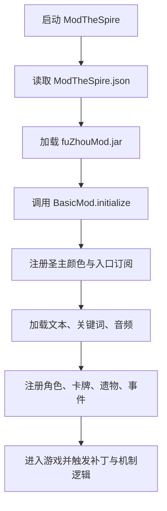

# 圣主历险记 / Demon Sorcerer

这是一个基于 `BasicMod` 框架开发的《杀戮尖塔》Mod。项目当前主题围绕《成龙历险记》里的圣主、十二符咒、黑影兵团、黑手帮、八大恶魔气与相关剧情事件展开。

原来的框架模板说明已保留为 [README_BasicMod_Template.md](README_BasicMod_Template.md)。

## 项目概览

- Mod ID：`fuZhouMod`
- Maven 名称：`fuZhou`
- 当前版本：`1.1.8`
- 主入口：[src/main/java/basicmod/BasicMod.java](src/main/java/basicmod/BasicMod.java)
- ModTheSpire 配置：[src/main/resources/ModTheSpire.json](src/main/resources/ModTheSpire.json)
- 主要依赖：`ModTheSpire`、`BaseMod`、`StSLib`
- Java 版本：`1.8`

## 主要内容

本项目目前包含以下核心内容：

- 新角色：圣主。
- 十二符咒遗物与对应符咒卡牌。
- 阿福招式牌，并接入对应出牌音频。
- 黑手帮牌组与黑手层数机制。
- 黑影兵团、面具、影蚀等相关机制。
- 八大恶魔气卡牌与异常状态互动。
- 专属/扩展事件，例如抢夺符咒、恶魔小龙、刀龙黑气、远古的封印、十三区、岁月史书。
- 大法师老爹 Boss 及相关意图、诅咒、封印逻辑。
- 潘库宝盒、岁月史书残卷、符咒探测仪等遗物和事件联动。

## 项目结构

```text
src/main/java/basicmod
├── BasicMod.java          # Mod 入口，负责注册角色、卡牌、遗物、事件、音频、文本
├── actions                # 自定义动作
├── cards                  # 卡牌主体，含阿福、黑手帮、符咒、面具、恶魔气等子模块
├── character              # 圣主角色
├── events                 # 自定义事件
├── helpers                # 机制辅助类
├── monsters               # 自定义怪物 / Boss
├── patches                # ModTheSpire 补丁
├── powers                 # 能力与状态
├── relics                 # 遗物
├── ui                     # 营火选项、附魔界面等 UI 逻辑
└── util                   # 工具类、音频、图片加载等

src/main/resources/basicmod
├── audio                  # 打牌音效等音频资源
├── images                 # 卡牌、遗物、角色、能力、Boss 等图片资源
└── localization           # 中英文文本
```

## 启动流程



## 开发环境准备

1. 安装《杀戮尖塔》本体。
2. 通过 Steam 创意工坊安装以下依赖：
   - ModTheSpire
   - BaseMod
   - StSLib
3. 准备 JDK 8。
4. 准备 Maven。
5. 检查 [pom.xml](pom.xml) 里的 Steam 路径：

```xml
<steam.windows>D:/steam/steamapps</steam.windows>
```

如果你的 Steam 不在 `D:/steam/steamapps`，需要改成自己的 `steamapps` 路径。

## 编译与安装

在项目根目录执行：

```bash
mvn package
```

打包成功后会生成：

```text
target/fuZhouMod.jar
```

同时，`pom.xml` 中的打包配置会尝试把 jar 复制到：

```text
D:/steam/steamapps/common/SlayTheSpire/mods/fuZhouMod.jar
```

如果你的 Steam 路径不同，请先修改 `pom.xml`，否则复制步骤会失败。

## 运行方式

1. 启动 `ModTheSpire`。
2. 勾选 `BaseMod`、`StSLib` 和 `fuZhouMod`。
3. 进入游戏后选择新角色“圣主”。
4. 开始爬塔，测试符咒、黑影兵团、黑手帮、恶魔气、事件与 Boss 相关内容。

## 本地化与资源

- 中文文本：`src/main/resources/basicmod/localization/zhs`
- 英文文本：`src/main/resources/basicmod/localization/eng`
- 卡牌图片：`src/main/resources/basicmod/images/cards`
- 遗物图片：`src/main/resources/basicmod/images/relics`
- 能力图片：`src/main/resources/basicmod/images/powers`
- 阿福音频：`src/main/resources/basicmod/audio/afu`

新增卡牌、遗物、能力或事件时，通常需要同时补齐 Java 类、图片资源和本地化 JSON。

## 开发注意事项

- 新卡牌建议继承项目里的 `BaseCard`。
- 新遗物建议继承项目里的 `BaseRelic`。
- ID 统一通过 `BasicMod.makeID(...)` 生成，避免和其他 Mod 冲突。
- 注册入口主要集中在 `BasicMod`，很多卡牌和遗物通过 `AutoAdd` 扫描注册。
- 修改事件、遗物、符咒或面具逻辑前，建议先看 `helpers` 和 `patches` 目录，很多机制不是只靠单个类完成的。
- 中文 JSON 文本里会出现游戏关键字标记，例如 `*黑手帮`、`#b`、`NL`，修改时要保留《杀戮尖塔》的文本格式。

## 常见问题

### 找不到游戏或依赖 jar

优先检查 `pom.xml` 中的 `steam.windows`、`steam.mac` 或 `steam.linux` 路径是否正确。Maven 会从 Steam 游戏目录和创意工坊目录里读取本体与依赖 jar。

### 打包成功但游戏里看不到 Mod

检查：

- `target/fuZhouMod.jar` 是否生成。
- jar 是否被复制到《杀戮尖塔》的 `mods` 目录。
- ModTheSpire 中是否勾选了 `fuZhouMod`。
- `BaseMod` 和 `StSLib` 是否也被勾选。

### 文本乱码

项目源码和资源建议统一使用 UTF-8。`pom.xml` 已配置：

```xml
<project.build.sourceEncoding>UTF-8</project.build.sourceEncoding>
```

如果编辑器里看到乱码，先检查文件编码和编辑器默认编码。

## 发布资料

Steam 创意工坊相关资料放在：

```text
关于发布steam创意工坊
```

其中包含发布文档和配置文件，可作为后续上传或更新创意工坊页面时的参考。
